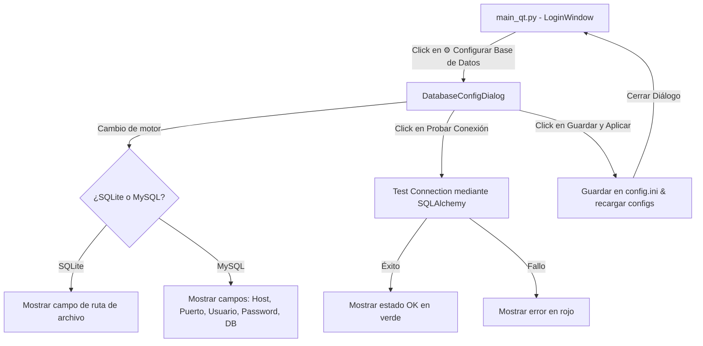

# Diseño: Selector y Configurador de Base de Datos en Caliente (SQLite / MySQL)

**Fecha:** 2026-05-24  
**Autor:** Antigravity (AI Pair Programmer)  
**Tema:** Permitir al usuario seleccionar y configurar en caliente la base de datos (SQLite o MySQL) directamente desde la interfaz gráfica.

---

## 1. Diagnóstico y Estado Actual

Al revisar el proyecto, hemos identificado lo siguiente:
1. **Configuración de base de datos activa:** El proyecto utiliza `config.ini` en la raíz como la fuente principal de verdad de la configuración (`core/config.py`).
2. **Motor activo:** En `config.ini`, bajo la sección `[database]`, está configurado `engine = sqlite`. Por lo tanto, la aplicación **actualmente está usando SQLite** (creando el archivo `dinamo_rent_v3.db` en la raíz).
3. **Variables de entorno (.env):** Existe un archivo `.env` en la raíz con `DINAMO_DB_ENGINE=mysql`. Sin embargo, `core/config.py` explícitamente indica que ya no utiliza `python-dotenv` en tiempo de ejecución. Salvo que `DINAMO_DB_ENGINE` esté definido en las variables del sistema operativo (por ejemplo, en Docker o consola antes de lanzar), esa variable es ignorada en el arranque estándar de desarrollo/producción, prevaleciendo el valor `sqlite` de `config.ini`.

---

## 2. Enfoque Seleccionado (Enfoque B - Integración en la UI)

Para brindar la mejor experiencia de usuario y facilitar a los desarrolladores y administradores cambiar de base de datos sin alterar manualmente archivos de configuración, integraremos un **Diálogo de Configuración de Base de Datos** directamente en la pantalla de Inicio de Sesión (`LoginWindow`).

### Beneficios del Enfoque:
- **Profesional y Premium:** Común en sistemas ERP empresariales, permitiendo configurar la conexión antes de ingresar.
- **Sin Configuración Manual:** Evita tener que editar `config.ini` o configurar variables de entorno del sistema operativo.
- **Validación Integrada:** El usuario puede probar la conexión en tiempo real antes de guardar los cambios.
- **Hot-Reload / Reinicio Grácil:** Al guardar los cambios, la aplicación recarga la configuración y reinicializa la conexión sin requerir cerrar el proceso manualmente si es posible, o reiniciando graciosamente el proceso.

---

## 3. Diseño Detallado

### 3.1. Diálogo de Configuración de Base de Datos (`DatabaseConfigDialog`)
Crearemos un nuevo módulo `views/database_config_dialog.py` que contendrá la clase `DatabaseConfigDialog` basada en `QDialog`.

**Alineación Estética:**
- Usará el sistema de estilos oscuros/modernos de la aplicación.
- Heredará la tipografía y bordes redondeados que caracterizan a la UI de Dinamo Rent.

**Componentes y Lógica:**
1. **Selector de Motor (QComboBox):** Opciones `SQLite (Local)` y `MySQL (Servidor)`.
2. **Formulario Dinámico:** 
   - Si se selecciona **SQLite**, se muestra un único campo para la ruta del archivo (por defecto `dinamo_rent_v3.db`).
   - Si se selecciona **MySQL**, se muestran los campos habituales: `Host`, `Puerto`, `Usuario`, `Contraseña` (con enmascaramiento opcional), y `Nombre de la Base de Datos`.
3. **Botón "Probar Conexión" (`btn_test`):** 
   - Intenta conectarse a la base de datos configurada usando SQLAlchemy temporalmente.
   - Muestra un indicador visual de éxito (verde "✅ Conexión Exitosa") o error (rojo "❌ Error: [detalle corto]").
4. **Botones de Acción:**
   - **Guardar y Aplicar:** Guarda los cambios en `config.ini` (usando `guardar_configuracion` del core), recarga los módulos de configuración y base de datos, y cierra el diálogo.
   - **Cancelar:** Cierra el diálogo sin aplicar cambios.

---

### 3.2. Integración en la Ventana de Login (`LoginWindow`)
En `main_qt.py`, dentro de la clase `LoginWindow`:
- Agregaremos un botón o enlace plano premium al final de la tarjeta de login o debajo del botón "Iniciar Sesión".
- Texto: `⚙️ Configurar Base de Datos`
- Al hacer clic, instanciará y mostrará el `DatabaseConfigDialog`.



---

### 3.3. Mecanismo de Hot-Reload de Configuración y Motor de Base de Datos
Para aplicar los cambios en caliente sin forzar al usuario a cerrar manualmente el programa, implementaremos una recarga dinámica de la base de datos:

1. **Recarga de `core.config`:**
   Dado que las variables de configuración se cargan a nivel de módulo, al guardar la nueva configuración se llamará a:
   ```python
   import importlib
   import core.config
   import core.database_sa

   # 1. Recargar el lector de config.ini
   importlib.reload(core.config)
   ```
2. **Re-inicialización del Engine de SQLAlchemy:**
   En `core/database_sa.py`, reiniciaremos los singletons deferred:
   ```python
   # En core/database_sa.py agregaremos una función para resetear la conexión:
   def reset_database_connection():
       global _engine, _SessionMaker
       if _engine is not None:
           _engine.dispose()
       _engine = None
       _SessionMaker = None
   ```
3. **Reinicialización completa:**
   Al guardar con éxito la nueva base de datos, el diálogo:
   - Resetea la conexión llamando a `reset_database_connection()`.
   - Vuelve a ejecutar `init_db()` de `core/database_sa` para asegurar que las tablas y migraciones necesarias estén presentes en el motor seleccionado.
   - Si todo es correcto, la aplicación continuará funcionando con el nuevo motor de base de datos seleccionado.

---

## 4. Plan de Verificación

### 4.1. Pruebas Manuales
1. **Verificar estado inicial:** Iniciar la app y ver en logs que arranca con SQLite.
2. **Cambiar a MySQL:**
   - Hacer clic en `⚙️ Configurar Base de Datos`.
   - Seleccionar MySQL.
   - Poner las credenciales del servidor local/remoto de MySQL.
   - Hacer clic en "Probar Conexión" y verificar que conecte (o muestre el error correspondiente si las credenciales son incorrectas).
   - Guardar y aplicar.
3. **Verificar transición:**
   - Confirmar en la consola o logs de la aplicación que se ejecutan los scripts de creación de tablas y migraciones sobre el motor MySQL.
   - Intentar iniciar sesión con las credenciales correspondientes.
4. **Volver a SQLite:**
   - Repetir el proceso seleccionando SQLite para validar la bidireccionalidad.

---

## 5. Próximos Pasos

1. Presentar esta especificación al usuario y esperar su aprobación.
2. Una vez aprobada, crear el plan de implementación detallado en `docs/superpowers/plans/` y proceder con la implementación paso a paso bajo la ley de TDD.
